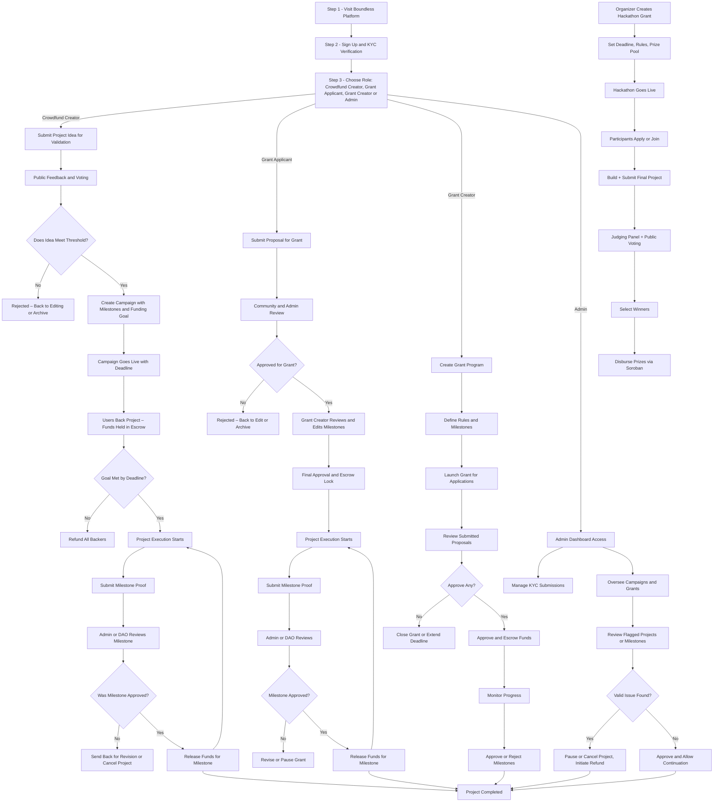

# Boundless

Boundless is a decentralized crowdfunding and grants platform built on the Stellar blockchain that empowers creators, innovators, and communities to launch and fund projects in a transparent and secure manner. Leveraging Soroban smart contracts, the platform facilitates milestone-based fund releases with built-in escrow mechanisms, ensuring that funds are only released when specific project milestones are met and independently verified. This approach minimizes risks for backers and provides creators with the financial support they need to drive innovation forward.

## ✨ Key Features

- **Decentralized crowdfunding and grant management** on the Stellar blockchain
- **Milestone-based fund distribution** using escrow and smart contracts
- **Secure and transparent community voting and feedback systems**
- **Flexible user roles** including campaign creators, grant applicants, managers, and admins
- **Integrated authentication** with email, social login, and KYC verification
- **Multi-wallet support** for Stellar ecosystem (Freighter, Albedo, Rabet, xBull, Lobstr, Hana, HOT Wallet)
- **Comprehensive backend support** with RESTful API endpoints and robust security measures
- **Automated contract deployment and upgrade processes** using CI/CD pipelines

## 🛠️ Technical Stack

- **Smart Contracts:** Rust (Soroban SDK)
- **Frontend:** TypeScript, Next.js 15, React 19, Tailwind CSS, Zustand
- **Backend:** Node.js, RESTful APIs, Prisma ORM, PostgreSQL
- **Blockchain Integration:** Stellar SDK, Soroban smart contracts
- **Authentication:** NextAuth.js v5 with Google OAuth and credentials
- **UI Components:** Radix UI primitives with custom styling
- **Animations:** GSAP, Framer Motion
- **DevOps:** GitHub Actions, Vercel, Docker

## 📁 Project Structure

```
boundless/
├── app/                          # Next.js App Router
│   ├── (landing)/               # Landing page routes
│   │   ├── about/               # About page components
│   │   ├── blog/                # Blog functionality
│   │   ├── code-of-conduct/     # Code of conduct page
│   │   ├── contact/             # Contact page
│   │   ├── disclaimer/          # Disclaimer page
│   │   ├── grants/              # Grants information
│   │   ├── hackathons/          # Hackathon pages
│   │   ├── privacy/             # Privacy policy
│   │   ├── projects/            # Projects page
│   │   ├── terms/               # Terms of service
│   │   ├── waitlist/            # Waitlist signup
│   │   ├── layout.tsx           # Landing layout
│   │   └── page.tsx             # Landing page
│   ├── api/                     # API routes
│   │   ├── auth/                # Authentication endpoints
│   │   └── waitlist/            # Waitlist API
│   ├── auth/                    # Authentication pages
│   │   ├── email-verified/      # Email verification success
│   │   ├── forgot-password/     # Password reset request
│   │   ├── reset-password/      # Password reset form
│   │   ├── signin/              # Sign in page
│   │   ├── signup/              # Sign up page
│   │   └── verify-email/        # Email verification
│   ├── comment/                 # Comment functionality
│   ├── dashboard/               # User dashboard
│   ├── preview/                 # Preview functionality
│   ├── test/                    # Test pages
│   ├── user/                   # User-specific pages
│   │   ├── campaigns/          # User campaigns
│   │   ├── projects/           # User projects
│   │   └── layout.tsx          # User layout
│   ├── error.tsx               # Error page
│   ├── favicon.ico             # Site favicon
│   ├── globals.css             # Global styles
│   ├── layout.tsx              # Root layout
│   ├── loading.tsx             # Loading page
│   ├── not-found.tsx           # 404 page
│   ├── providers.tsx           # App providers
│   ├── robots.ts               # Robots.txt
│   └── sitemap.ts              # Sitemap generation
├── components/                 # React components
│   ├── About-Mission/         # About mission components
│   ├── auth/                  # Authentication components
│   ├── buttons/               # Button components
│   ├── campaigns/             # Campaign-related components
│   │   ├── back-project/      # Project backing flow
│   │   ├── backing-history/   # Backing history
│   │   ├── launch/            # Campaign launch
│   │   └── LaunchCampaignFlow.tsx
│   ├── comment/               # Comment components
│   ├── comments/              # Comments system
│   ├── connect-wallet/        # Wallet connection UI
│   ├── landing-page/          # Landing page components
│   ├── layout/                # Layout components
│   ├── loading/               # Loading components
│   ├── overview/              # Overview components
│   ├── project/               # Project components
│   ├── providers/             # Provider components
│   ├── sheet/                 # Sheet components
│   ├── skeleton/              # Skeleton components
│   ├── stepper/               # Stepper components
│   ├── testimonials/          # Testimonial components
│   ├── ui/                    # Reusable UI components (48 components)
│   ├── wallet/                # Wallet-related components
│   └── waitlist/              # Waitlist components
├── hooks/                     # Custom React hooks
│   ├── use-account.ts         # Account management hook
│   ├── use-auth.ts            # Authentication hook
│   ├── use-fadegradient.ts   # Fade gradient hook
│   ├── use-local-storage-draft.ts # Local storage draft hook
│   ├── use-mobile.ts          # Mobile detection hook
│   ├── use-notifications.ts   # Notifications hook
│   ├── use-wallet-protection.ts # Wallet protection hook
│   └── use-wallet.ts          # Wallet management hook
├── lib/                       # Utility libraries
│   ├── api/                   # API client and types
│   ├── auth/                  # Authentication utilities
│   ├── data/                  # Data utilities
│   ├── stores/                # Zustand stores
│   ├── wallet-utils.ts        # Wallet utilities
│   ├── utils.ts               # General utilities
│   ├── config.ts              # Configuration
│   ├── logger.ts              # Logging utilities
│   ├── metadata.ts            # Metadata utilities
│   ├── mock.ts                # Mock data
│   ├── motion.ts              # Motion utilities
│   └── structured-data.ts     # Structured data
├── types/                     # TypeScript type definitions
│   ├── project.ts             # Project types
│   ├── backing-history.ts     # Backing history types
│   └── logger.types.ts        # Logger types
├── public/                    # Static assets
│   ├── wallets/               # Wallet icons
│   ├── landing/               # Landing page assets
│   ├── auth/                  # Authentication assets
│   ├── empty/                 # Empty state assets
│   └── team/                  # Team assets
├── scripts/                   # Build and deployment scripts
│   └── setup-branch-protection.sh
├── constants/                 # Application constants
├── auth.ts                    # NextAuth configuration
├── middleware.ts              # Next.js middleware
├── next.config.ts             # Next.js configuration
├── tsconfig.json              # TypeScript configuration
├── eslint.config.mjs          # ESLint configuration
├── postcss.config.mjs         # PostCSS configuration
├── components.json            # UI components configuration
├── vercel.json                # Vercel deployment configuration
├── package.json               # Dependencies and scripts
├── package-lock.json          # Package lock file
├── CONTRIBUTING.md            # Contribution guidelines
├── DEVELOPMENT.md             # Development workflow
└── LICENSE                    # MIT License
```

## 🚀 Getting Started

### Prerequisites

Before you begin, ensure you have the following installed:

- **Node.js** (v18 or higher) - [Download here](https://nodejs.org/)
- **npm** or **yarn** - Package manager
- **Git** - Version control
- **Docker** (optional) - For local blockchain and database services

### Installation

1. **Fork the repository:**
   - Go to [boundless-frontend](https://github.com/boundlessfi/boundless-frontend)
   - Click the "Fork" button in the top-right corner
   - This creates a copy of the repository in your GitHub account

2. **Clone your fork:**

   ```bash
   git clone https://github.com/YOUR_USERNAME/boundless-frontend.git
   cd boundless-frontend
   ```

3. **Add upstream remote:**

   ```bash
   git remote add upstream https://github.com/boundlessfi/boundless-frontend.git
   ```

4. **Install dependencies:**

   ```bash
   npm install
   # or
   yarn install
   ```

5. **Configure environment variables:**
   Create a `.env.local` file in the root directory:

   ```bash
   touch .env.local
   ```

   Fill in the required environment variables in `.env.local`:

   ```env
   # NextAuth Configuration
   NEXTAUTH_SECRET=your-secret-key
   NEXTAUTH_URL=http://localhost:3000

   # Google OAuth (optional)
   GOOGLE_CLIENT_ID=your-google-client-id
   GOOGLE_CLIENT_SECRET=your-google-client-secret

   # API Configuration
   NEXT_PUBLIC_API_URL=http://localhost:8000/api

   # Stellar Configuration
   NEXT_PUBLIC_STELLAR_NETWORK=testnet
   NEXT_PUBLIC_APP_URL=http://localhost:3000

   # Trustless Work Configuration (optional)
   # Get your API key from: https://docs.trustlesswork.com
   NEXT_PUBLIC_TRUSTLESS_WORK_API_KEY=your-trustless-work-api-key
   ```

6. **Run the development server:**

   ```bash
   npm run dev
   # or
   yarn dev
   ```

7. **Open your browser:**
   Navigate to [http://localhost:3000](http://localhost:3000) to see the application.

### Available Scripts

```bash
# Development
npm run dev          # Start development server
npm run build        # Build for production
npm run start        # Start production server

# Code Quality
npm run lint         # Run ESLint
npm run lint:fix     # Run ESLint with auto-fix
npm run type-check   # Run TypeScript type checking
npm run format       # Format code with Prettier
npm run format:check # Check formatting without changing files

# Testing
npm run test         # Run tests
npm run test:watch   # Run tests in watch mode
npm run test:coverage # Run tests with coverage

# Git Hooks
npm run prepare      # Install Husky hooks
```

## 🔄 User Flow



## 🤝 Contributing

We welcome contributions from the community! Please follow these steps:

1. **Fork the repository** and create your branch from `main`
2. **Clone your fork** and set up the project locally
3. **Create a descriptive branch name** (e.g., `feature/add-auth`, `fix/typo-in-readme`)
4. **Make your changes** with clear, concise commits following [Conventional Commits](https://www.conventionalcommits.org/)
5. **Write tests** for new features or bug fixes
6. **Ensure all tests pass** and code quality checks pass
7. **Open a pull request** with a clear description of your changes

For detailed contribution guidelines, see [CONTRIBUTING.md](CONTRIBUTING.md).

For development workflow and best practices, see [DEVELOPMENT.md](DEVELOPMENT.md).

## 📄 License

This project is licensed under the MIT License. See [LICENSE](LICENSE) for details.

## 🙏 Acknowledgements

- [Stellar Development Foundation](https://stellar.org/)
- [Soroban SDK](https://soroban.stellar.org/)
- [Next.js](https://nextjs.org/), [Tailwind CSS](https://tailwindcss.com/), [Zustand](https://zustand-demo.pmnd.rs/)
- [Radix UI](https://www.radix-ui.com/) for accessible components
- [GSAP](https://greensock.com/gsap/) for animations
- [Docker](https://www.docker.com/), [Vercel](https://vercel.com/), [GitHub Actions](https://github.com/features/actions)

## 📞 Support

- **Documentation:** [GitHub Wiki](https://github.com/boundlessfi/boundless-frontend/wiki)
- **Issues:** [GitHub Issues](https://github.com/boundlessfi/boundless-frontend/issues)
- **Discussions:** [GitHub Discussions](https://github.com/boundlessfi/boundless-frontend/discussions)
- **Email:** hello@boundlessfi.xyz

---

**Made with ❤️ by the Boundless team**
